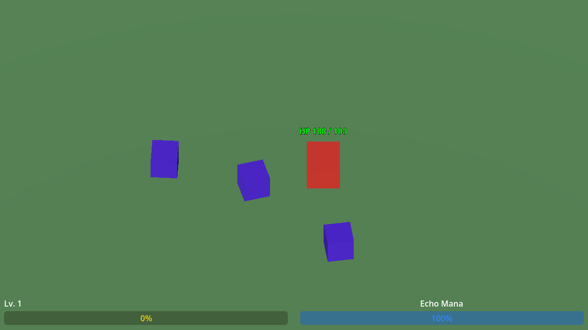
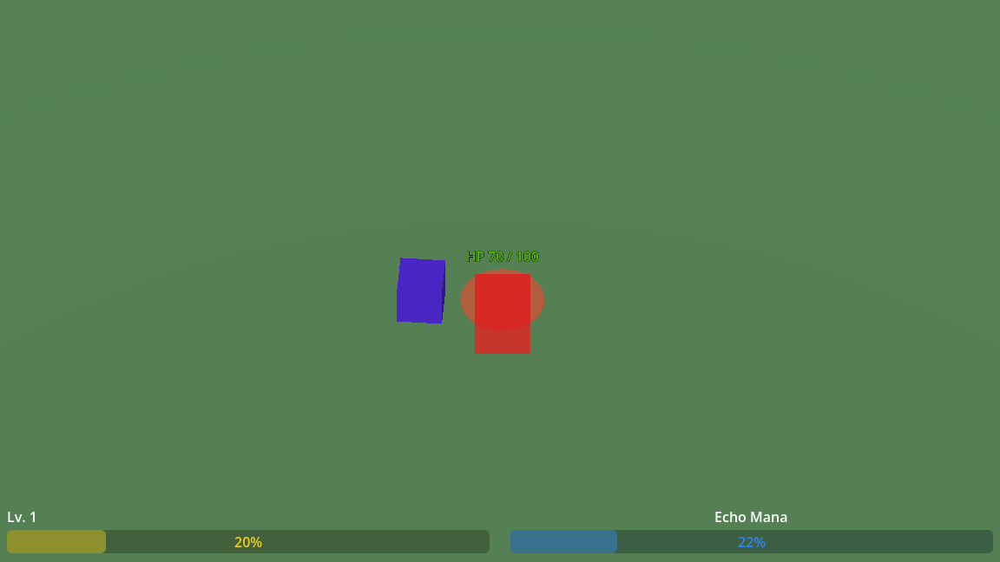
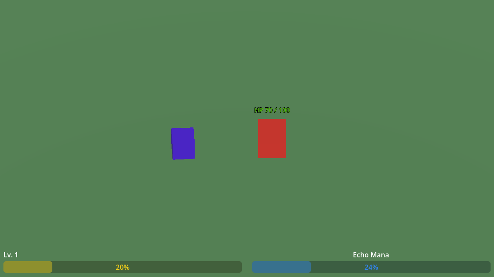

# Playtest Smoke — Screenshot Reference

Captured PNGs from a single run of [`tests/playtest_smoke.gd`](../../../tests/playtest_smoke.gd) on `main` after PR #16 (visual mode added). Useful as a baseline to spot HUD-layout regressions or unexpected world state in future runs.

## How to regenerate

```bash
"$GODOT" --path . -s tests/playtest_smoke.gd && ls /tmp/arcane-net-smoke/
```

Re-run without `--headless` — screenshots are skipped when the dummy renderer is active. PNGs land in `/tmp/arcane-net-smoke/` every 5 seconds for 30 s (6 frames).

## What each frame should show

| HUD element | Position | Source |
|---|---|---|
| Player HP (text label) | above player mesh | `Player.tscn` → child `Label3D` |
| Player health bar (red rectangle visual) | player body | `Player.tscn` mesh — currently a red `BoxMesh` |
| Enemy meshes | blue `BoxMesh`es | `GlitchPup.tscn` |
| `Lv. N` text + XP bar | bottom-left | HUD scene |
| `Echo Mana` bar | bottom-right | HUD bound to `ManaComponent.mana_changed` |

## Frame-by-frame baseline

### `smoke_00_t0001.png` — t = 1 s, "encounter just started"


- **HP**: `100 / 100` — player just spawned
- **XP**: `0%` (Lv. 1) — no kills yet
- **Echo Mana**: `100%` — full reserve, Echo about to pick DamageSpike on its next tick
- **World**: player (red) flanked by 3 Glitch Pups (blue), one of which just spawned in the back

### `smoke_02_t0011.png` — t = 11 s, "after first DamageSpike cast"


- **HP**: `70 / 100` — player has been hit 3 times by Glitch Pups
- **XP**: `20%` (Lv. 1) — 2 Pups dead (one from `DamageSpikeAction.execute(80)`, one from synthetic attack input)
- **Echo Mana**: `22%` — DamageSpike fired (`100 → 20`) plus ~2 s of regen
- **World**: 1 Pup left, in melee with player

Confirms `DamageSpike` execute path runs cleanly when invoked by Echo — the bug we caught and fixed in PR #15 (XPNumberPopup null parent) does not reappear.

### `smoke_05_t0026.png` — t = 26 s, "long after cooldown"


- **HP**: `70 / 100` — no further hits this window
- **XP**: `20%` (Lv. 1) — unchanged
- **Echo Mana**: `24%` — regen `22 → 24` over 15 s = `0.13/sec` ≈ **10/min spec from GDD 6.8** ✓
- **DamageSpike on cooldown**: 60 s cooldown gate still active, Echo holds mana

This frame is the GDD-correctness check: mana does NOT bounce back fast enough to enable a second DamageSpike before the cooldown expires, exactly as intended.

## Other frames

| File | t | Use |
|---|---|---|
| `smoke_01_t0006.png` | 6 s | first tick after `DamageSpike` execute — see Mana dropped from 100% to ~20% |
| `smoke_03_t0016.png` | 16 s | mid-encounter, mana still stuck near 22% (cooldown holding) |
| `smoke_04_t0021.png` | 21 s | late-encounter, no Heal triggered because synthetic input never drops player HP < 30% |

## Limitations

These frames do **not** verify:
- Camera smoothing / shake — single still frame can't show motion
- Hitstop length, animation transitions, dash feel
- Audio cues
- Skill UI on level-up (synthetic input doesn't accumulate enough XP for `level_up_triggered`)

Use manual playtest for those (see `/playtest-check`).
